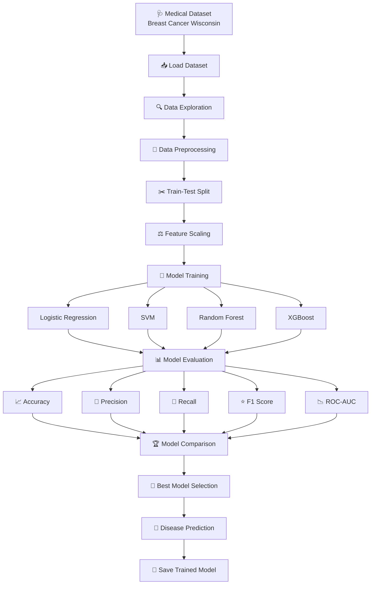
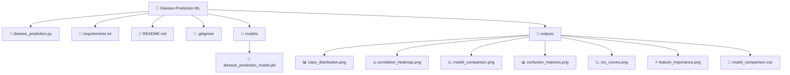

# 🩺 Disease Prediction from Medical Data

## CodeAlpha Machine Learning Internship — Task 4

A machine learning classification project that predicts whether a breast tumor is **benign or malignant** using medical diagnostic measurements.

The project implements and compares multiple machine learning algorithms to determine their performance on structured medical data.

---

## 📌 Project Overview

Disease prediction is an important application of machine learning in healthcare. This project demonstrates how supervised classification algorithms can be applied to medical diagnostic data to classify tumor cases into two categories:

- **Benign**
- **Malignant**

The project focuses on data preprocessing, exploratory data analysis, model training, evaluation, comparison, and prediction.

> ⚠️ **Disclaimer:** This project is intended for educational and machine-learning demonstration purposes only. It is not a medical diagnostic tool and should not be used for clinical decision-making.

---

## 🎯 Objective

The main objective of this project is to:

- Analyze structured medical data.
- Preprocess the dataset for machine learning.
- Apply classification algorithms.
- Compare different machine learning models.
- Evaluate model performance using multiple metrics.
- Select the best-performing model.
- Save the trained model for future use.

---

## 📊 Dataset

This project uses the **Breast Cancer Wisconsin Diagnostic Dataset** available through Scikit-learn.

### Dataset Details

- **Total records:** 569
- **Medical features:** 30
- **Target classes:** 2

### Target Classes

| Value | Diagnosis |
|---:|---|
| 0 | Benign |
| 1 | Malignant |

---

## 🔬 Medical Features

The dataset contains numerical diagnostic measurements such as:

- Mean Radius
- Mean Texture
- Mean Perimeter
- Mean Area
- Mean Smoothness
- Mean Compactness
- Mean Concavity
- Mean Concave Points
- Mean Symmetry
- Mean Fractal Dimension
- Radius Error
- Texture Error
- Perimeter Error
- Area Error
- Smoothness Error
- Compactness Error
- Concavity Error
- Concave Points Error
- Symmetry Error
- Fractal Dimension Error
- Worst Radius
- Worst Texture
- Worst Perimeter
- Worst Area
- Worst Smoothness
- Worst Compactness
- Worst Concavity
- Worst Concave Points
- Worst Symmetry
- Worst Fractal Dimension

---

## 🤖 Machine Learning Algorithms

Four classification algorithms were implemented and compared:

### 1. Logistic Regression

A linear classification algorithm used as a strong baseline model for binary classification.

### 2. Support Vector Machine (SVM)

A supervised learning algorithm that finds an optimal decision boundary between classes.

### 3. Random Forest

An ensemble learning algorithm that combines multiple decision trees to improve classification performance.

### 4. XGBoost

A powerful gradient boosting algorithm designed for efficient and accurate classification and regression tasks.

---

## ⚙️ Project Workflow

## 📈 Evaluation Metrics

The models were evaluated using:

* Accuracy
* Precision
* Recall
* F1 Score
* ROC-AUC
* Confusion Matrix
* ROC Curve

These metrics provide a more complete evaluation than accuracy alone.

## 🏆 Model Performance
| Model                   |   Accuracy |   Precision |     Recall |    F1 Score |    ROC-AUC |
| ----------------------- | ---------: | ----------: | ---------: | ----------: | ---------: |
| **SVM**                 | **97.37%** | **100.00%** | **92.86%** |  **96.30%** | **≈96.3%** |
| **Random Forest**       | **97.37%** | **100.00%** | **92.86%** |  **96.30%** | **≈96.3%** |
| **XGBoost**             | **97.37%** | **100.00%** | **92.86%** |  **96.30%** | **≈96.3%** |
| **Logistic Regression** | **96.49%** |  **97.50%** | **92.86%** | **≈95.12%** |          — |

## 📊 Visualizations

The project automatically generates several visualizations:

## Class Distribution

Shows the distribution of benign and malignant cases.

## Correlation Heatmap

Shows relationships between selected medical features.

## Model Comparison

Compares the performance of Logistic Regression, SVM, Random Forest, and XGBoost.

## Confusion Matrices

Displays correct and incorrect predictions for each classification model.

## ROC Curves

Compares the classification performance of the models across different thresholds.

## Feature Importance

Shows the most influential medical features for tree-based models when applicable.

## 📁 Project Structure

## 🛠️ Technologies Used
* Python
* NumPy
* Pandas
* Matplotlib
* Seaborn
* Scikit-learn
* XGBoost
* Joblib

## 🚀 Installation

### 1. Clone the Repository

git clone https://github.com/vaishnavibansal/Disease-Prediction-ML.git

### 2. Navigate to the Project Directory
cd Disease-Prediction-ML

### 3. Install Dependencies
pip install -r requirements.txt

### Run the Project
python disease_prediction.py

The program will:

* Load the medical dataset.
* Perform data exploration.
* Check for missing values.
* Split the data into training and testing sets.
* Train four machine learning models.
* Evaluate their performance.
* Compare the models.
* Identify the best-performing model.
* Generate visualizations.
* Save the trained model.

## 🔍 Example Prediction
Actual diagnosis    : Benign
Predicted diagnosis : Benign
Malignant probability: 0.16%

## 📌 Key Findings
* BSVM achieved 97.37% test accuracy.
* Random Forest and XGBoost achieved comparable performance.
* Logistic Regression achieved 96.49% test accuracy.
* SVM, Random Forest, and XGBoost achieved 100% precision on the test set.
* The models demonstrated strong classification performance on the dataset.
* SVM was selected as the best model according to the project's evaluation criterion.

## 🚀 Future Improvements

Possible future improvements include:

* Testing additional medical datasets.
* Performing hyperparameter optimization.
* Applying cross-validation.
* Testing additional classification algorithms.
* Creating a dedicated prediction interface.
* Deploying the model for demonstration purposes.

## 👩‍💻 Author

Vaishnavi Bansal

Machine Learning Internship — CodeAlpha

## Task 4: Disease Prediction from Medical Data

## ⭐ Project Highlights

✔ Medical Data Classification
✔ Data Preprocessing
✔ Exploratory Data Analysis
✔ Logistic Regression
✔ Support Vector Machine
✔ Random Forest
✔ XGBoost
✔ Model Comparison
✔ Accuracy / Precision / Recall / F1
✔ ROC-AUC Analysis
✔ Confusion Matrix
✔ ROC Curve
✔ Feature Importance
✔ Model Persistence

## ⚠️ Disclaimer

This project is created for educational purposes as part of a machine learning internship.

The predictions generated by this project should not be interpreted as medical diagnoses or used as a replacement for professional medical advice.
